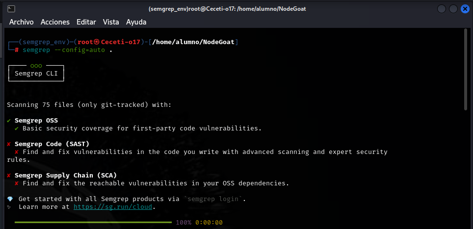

# PPS-Unidad3Actividad23-AnalisisEstaticoCodigoSAST
Análisis de Código Estático con SAST (Static Application Security Testing)

Este contenido se corresponde con la actividad 22 de la Unidad de Aprendizaje 3 de Puesta en Producción Segura, vamos a ver la identificación de vulnerabilidades en código fuente.

## Objetivos

- Usar SAST para detectar problemas de seguridad en el código sin necesidad de ejecutarlo.
- Conocer los entornos CI/CD: Integración Contínua/Entrega Contínua


## SAST

__SAST__ (Static Application Security Testing) es una __técnica que permite analizar el código fuente de una aplicación para detectar vulnerabilidades antes de su despliegue__. No requiere ejecutar el software, por lo que permite encontrar errores antes en el ciclo de desarrollo.


## Semgrep

__Semgrep__ (Security Enhanced Multi-Grep) es una herramienta de análisis estático de código fuente, a diferencia de `grep`, Semgrep entiende la estructura del código y es capaz de detectar patrones de vulnerabilidades y malas prácticas.


### Ventajas:
- Detecta vulnerabilidades automáticamente
- Se puede integrar en pipelines CI/CD
- Soporta múltiples lenguajes (JavaScript, Python, Go, Java, etc.)
- Permite definir reglas personalizadas

---

## Instalación de Semgrep en entorno virtual

Esta opción evita conflictos con los paquetes del sistema y permite gestionar dependencias de forma aislada.

1. Crear un entorno virtual:

```bash
python3 -m venv semgrep_env
```

2. Activarlo:

```bash
source semgrep_env/bin/activate
```

Vemos como ya no aparece nuestro usuario en el `prompt` sino el entorno virtual activado `semgrep_env`


3. Instalar Semgrep dentro del entorno virtual que hemos creado:
 
```bash
pip install semgrep
```
> __Si tuvieras algún problema__ con la instalación con `pip` puedes probar con `snap`:

```bash
sudo apt install snap
snap install semgrep
```


4. Comprobar instalación:

```bash
semgrep --version
```

5. Para salir del entorno:
```bash
deactivate
```

---

## Análisis con Semgrep sobre NodeGoates una aplicación vulnerable creada para prácticas de seguridad con Node.js y MongoDB.

### ¿Qué es NodeGoat?

[NodeGoat](https://github.com/OWASP/NodeGoat) es una aplicación web de código abierto desarrollada por __OWASP__ (Open Web Application Security Project) que sirve como plataforma de aprendizaje para la seguridad en aplicaciones __Node.js__.

Características Principales de NodeGoat
1. Aplicación Vulnerable Intencionalmente: Contiene fallos de seguridad reales para practicar y aprender. Similar a otras plataformas como OWASP Juice Shop y Damn Vulnerable Web App (DVWA).
2. Simula un Entorno de Producción: Está desarrollada con `Node.js`, `Express.js` y `MongoDB`. Permite a los usuarios comprender cómo se implementan y explotan vulnerabilidades en aplicaciones reales.
3. Vulnerabilidades Presentes en NodeGoat: NodeGoat incluye ejemplos de diversas vulnerabilidades, como:
	- Inyección MongoDB
	- Cross-Site Scripting (XSS)
	- Cross-Site Request Forgery (CSRF)
	- Almacenamiento inseguro de contraseñas
	- Fallos de autenticación
	- Mal uso de funciones de Node.js

4. Ejercicios y Laboratorios Prácticos: `OWASP NodeGoat` proporciona guías interactivas y retos para que los usuarios exploten y solucionen las vulnerabilidades.
5. Facilidad de Instalación: Se puede ejecutar localmente con ` Docker`, `Node.js` o en plataformas en la nube como `Heroku`.

### Clonar y acceder al proyecto:
```bash
git clone https://github.com/OWASP/NodeGoat.git
cd NodeGoat
```

---

## Semgrep

__Semgrep__ <https://github.com/semgrep/semgrep> es una herramienta de análisis estático rápida y de código abierto que busca código, encuentra errores y aplica normas de seguridad y estándares de codificación. Semgrep es compatible con más de 30 lenguajes y puede ejecutarse en un IDE, como comprobación previa al compromiso y como parte de flujos de trabajo CI/CD.

### Instalación rápida:

```bash
pip install semgrep
```

### Análisis automático del código:

Activiamos el entorno virtual y ejecutamos:

```bash
source semgrep_env/bin/activate
semgrep --config=auto .
```


```
`--config=auto`  → Utiliza reglas automáticas recomendadas para detectar vulnerabilidades comunes.
`.` → Escanea todo el código dentro del directorio actual.
```




Esperamos a que se muestren los resultados, en esta ocasión muestra 15 problemas de código:


### Resultado:

Después de ejecutar el comando, Semgrep mostrará una lista de posibles vulnerabilidades con detalles como:

- El archivo y la línea donde se encuentra la vulnerabilidad.
- El tipo de riesgo detectado (XSS, Inyección NoSQL, CSRF, etc.).
- Recomendaciones para corregir el problema. También nos indica la página web donde podemos encontrar la explicación de la regla


Si pulsamos el enlace de la regla, nos llevará a la página de <https://sengreo.dev>, donde podemos encontrar información del problema y referencias a él.


En la siguiente captura vemos más detalles:


---

## Ejemplo: Código vulnerable vs seguro

### Evitar concatenación de datos en consultas SQL

__Código vulnerable__:
 
```javascript
db.query("SELECT * FROM users WHERE username = '" + user + "'");
```

__Código corregido__:

```javascript
db.query("SELECT * FROM users WHERE username = ?", [user]);
```

---

## Automatizar SAST en CI/CD (Integración y Entrega Continua)

### ¿Qué es CI/CD?

__CI/CD__ es un conjunto de prácticas de desarrollo de software que permite la integración automática, pruebas y despliegue de código de manera rápida y segura. Se compone de dos conceptos principales:

#### CI (Integración Continua - Continuous Integration)

__CI__ se enfoca en automatizar la integración del código en un repositorio compartido.


__Objetivo__:

• Permitir que los desarrolladores suban código frecuentemente.

• Ejecutar pruebas automatizadas para detectar errores lo antes posible.

• Asegurar que cada cambio en el código es estable y funcional.


__Ejemplo de CI__:

1. Un desarrollador hace un push de código a GitHub.

2. GitHub Actions (o GitLab CI, Jenkins, etc.) ejecuta pruebas automáticamente.

3. Si las pruebas fallan, el desarrollador recibe una notificación.

4. Si todo está bien, el código se fusiona en la rama principal (main o develop).


__Herramientas populares de CI__:
- GitHub Actions
- GitLab CI/CD
- Jenkins
- Travis CI
- CircleCI


#### CD (Entrega y/o Despliegue Continuo - Continuous Delivery / Continuous Deployment)

CD se divide en dos enfoques:

__Entrega Continua (Continuous Delivery)__

Se asegura de que el código esté siempre listo para desplegarse, pero el despliegue es manual.
Ejemplo: Una actualización está lista en producción, pero un ingeniero revisa y aprueba el despliegue.

__Despliegue Continuo (Continuous Deployment)__
Automatiza completamente el despliegue de código a producción sin intervención manual.
Ejemplo: Si las pruebas CI pasan, el código se despliega automáticamente en producción.

__Herramientas populares de CD__:

- Docker

- Kubernetes

- AWS CodeDeploy

- GitHub Actions (para despliegue)
- ArgoCD

__¿Por qué es importante CI/CD?__
- Reducción de errores → Los problemas se detectan temprano.

- Automatización → Se eliminan procesos manuales, ahorrando tiempo.

- Despliegues rápidos → Facilita la entrega de nuevas funcionalidades.

- Mejora la calidad del software → Pruebas constantes aseguran estabilidad.

 | *CI/CD*                       | __Descripción__                                         |
 |-------------------------------|---------------------------------------------------------|
 | __CI (Integración Continua)__:| Automatiza pruebas tras cada cambio.                    |
 | __CD (Entrega Continua)__:    | Código listo para desplegar, pero con aprobación manual.|
 | __CD (Despliegue Continuo)__: | Automatiza completamente el despliegue a producción     |

---

## Integración de Semgrep en GitHub Actions

Vamos a ver un ejemplo de CD/CI en `GitHub Actions`. Se trata de un pipeline que prueba código y lo despliega automáticamente si todo está bien:


Este repositorio es una prueba de integración de __Semgrep__, una herramienta de análisis estático (SAST), en un pipeline de GitHub Actions. La idea es usar un ejemplo sencillo en Python para validar que Semgrep se ejecuta correctamente en el flujo de CI/CD.

---


### Cómo probarlo

1. Crea un nuevo repositorio en GitHub (por ejemplo: `semgrep-prueba`).


2. Clónalo en local:
    ```bash
    git clone https://github.com/tu-usuario/semgrep-prueba.git
    cd semgrep-prueba
    ```
3.  Crea la estructura de carpetas:
    ```bash
    mkdir -p .github/workflows
    touch main.py README.md .github/workflows/semgrep.yml
    ```
__Estructura del proyecto__

```
semgrep-prueba/
├── .github/
│   └── workflows/
│       └── semgrep.yml
├── main.py
└── README.md
```
 __Código de ejemplo__
 
[Aquí tienes el archivo `main.py`](files/main.py)

Nos pide que introduzcamos un comando y utiliza `eval`. El análisis nos dará problemas relacionado con `eval()`.

archivo `main.py`
```python
# main.py
def main():
    comando = input("Introduce un comando de Python: ")
    eval(comando)  # Uso peligroso de eval()

if __name__ == "__main__":
    main()
```

---
4. ⚙️  Añade el workflow 

GitHub Actions usa archivos YAML dentro de .github/workflows/ para definir los pipelines.

Los `pipelines` son acciones que se desencadenan después de determinadas ejecuciones de git, como pueden ser `push`, `pull` o aquellas que decidamos.

[Aquí puedes descargar el Pipeline de GitHub Actions `.github/workflows/semgrep.yml`](files/semgrep.yml)

Crea el siguiente archivo para ejecutar Semgrep en cada push y pull request:

Pipeline de GitHub Actions `.github/workflows/semgrep.yml`

```yaml
name: Semgrep SAST Scan

on:
  push:
    branches:
      - main
      - develop
  pull_request:

jobs:
  semgrep:
    runs-on: ubuntu-latest

    steps:
      - name: Clonar repositorio
        uses: actions/checkout@v4

      - name: Instalar Semgrep
        run: pip install semgrep

      - name: Ejecutar análisis
        run: semgrep --config=auto --json --output=semgrep-results.json

      - name: Mostrar resultados
        run: cat semgrep-results.json

      - name: Guardar reporte
        uses: actions/upload-artifact@v4
        with:
          name: semgrep-report
          path: semgrep-results.json
```


- Al hacer `push` sobre ramas `main` y `develop` se desencadena la ejecuciónn que indicamos.
- Pasos que hacemos:
	- Instalamos `semgrep` con `pip` (por si no estuviera instalado).
	- Ejecutamos análisis con `semgrep` con conjunto de reglas `auto`.
	- Guardamos el resultado en archivo `semgrep-report`. 

5. Haz commit y push:
    ```bash
    git add .
    git commit -m "Primer commit con hola mundo y semgrep"
    git push origin main
    ```
6. Ve a la pestaña __Actions__ en GitHub para ver el pipeline en ejecución.

El análisis estático de Semgrep debería ejecutarse automáticamente en cada `push` a `main` o `develop`, o en cada `pull_request`, mostrando los resultados en la pestaña de Actions y guardando un reporte JSON como artefacto.


---

### Resultado esperado

Alli encontraremos el resultado de la ejecución de `semgrep`.


Podemos descargarnos el archivo .json con información sobre el resultado obtenido, debaY podemos descargar el archivo .json con información sobre el resultado.

Abajo podemos ver la información sobre el problema introducido por el uso de `eval()`


## Crear reglas personalizadas

Hasta ahora en la ejecución de `semgrep` hemos utilizado el conjunto de reglas por defecto ` --config=auto` `--config=semgrep-rules.yaml` o también el conjunto de reglas de __OWASP__ `--config "p/owasp-top-ten"`

Podemos crear reglas personalizadas

Archivo: `files/custom-rules.yaml`
```yaml
rules:
  - id: eval-personalizada
    pattern: eval(...)
    message: "Uso de eval() detectado. Eval puede ser peligroso si se usa con entrada no controlada."
    severity: WARNING
    languages:
      - python

```

Explicación:
__pattern__: __eval(...)__ → Detecta cualquier uso de `eval()`.

__message__ → Muestra una advertencia indicando los riesgos de `eval()`.

__severity__: __WARNING__ → Indica que es una advertencia, aunque puedes cambiarlo a ERROR si lo deseas.

__languages__: __python__ → Especifica que la regla aplica a código Python.


### Ejecutar análisis con las reglas personalizadas.

Vamos a realizar el análisis estático sobre nuestro repositorio `semgrep-prueba`

```bash
semgrep --config=files/custom-rules.yaml .
```


## Recursos

- [Semgrep Documentation](https://semgrep.dev/docs/)
- [OWASP NodeGoat](https://github.com/OWASP/NodeGoat)
- [OWASP Top Ten](https://owasp.org/www-project-top-ten/)

---

## Conclusión

- Usar herramientas como Semgrep permite detectar vulnerabilidades desde las primeras etapas del desarrollo, reduciendo costos y mejorando la calidad y seguridad del software. 
- Integrar SAST en pipelines CI/CD es una buena práctica profesional recomendada por OWASP y la industria.


